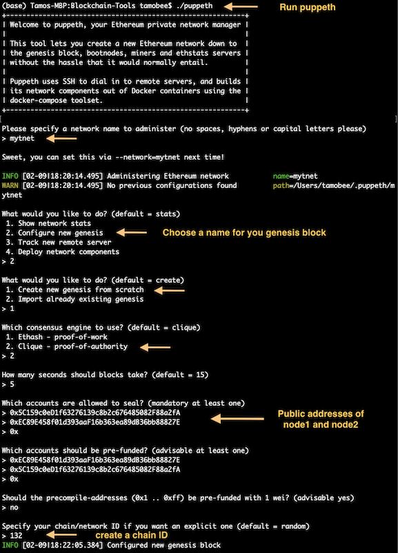
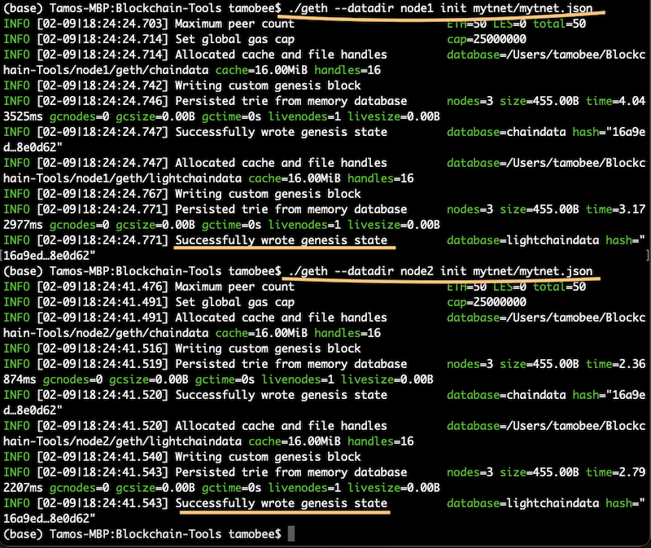
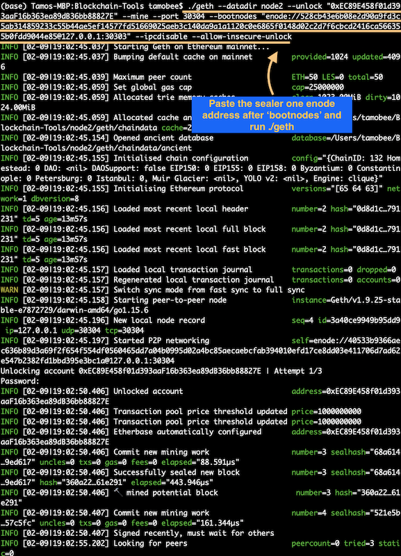
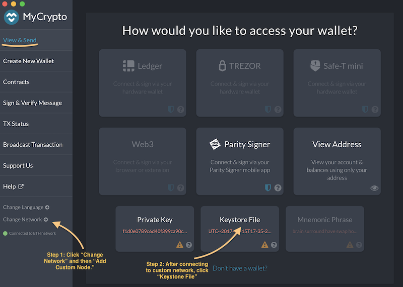
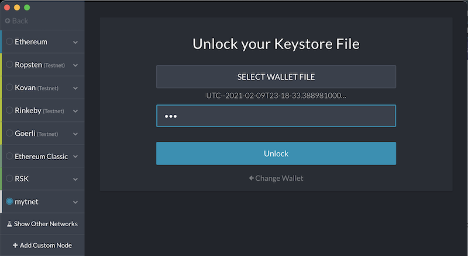

# Blockchain - Proof of Authority Development Chain

This assignment focuses on setting up a testnet blockchain using Proof of Authority (PoA) consensus algorithm.

In order to set up a testnet we need to download the following tools/applications:

[Go Ethereum](https://geth.ethereum.org/downloads/) - toolkit for creating blockchain, from the genesis block to mining tokens and making transactions.   

[MyCrypto](https://www.mycrypto.com/) - digital wallet to store and send/receive cryptocurrency.

---

## Instructions

1. Create accounts for two nodes for the network.

2. Create a genesis block

  * run puppeth
  * name the network
  * configure a new genesis block
  * choose `Clique (Proof of Authority)` consensus algorithm
  

  * export genesis block
  

3. Initialize the nodes

4. Begin mining

  * Node1
  

  * Node2
  

5. Add the blockchain to MyCrypto

 * Step 1: Set up the custom network. 
   * Under the "Network" column, scroll down to choose `Custom`
   * Fill in the information (The URL `http://127.0.0.1:8545` points to the default RPC port on your local machine).
   * Click `Save`
   

 * Step 2: After connecting to the custom network, click on `Keystore File` and then `Select Wallet File`.
    * Select the `keystore` folder inside the Node1 directory and select the file within it.
    * After typing in the password, click `Unlock`.
    

7. Send Transaction

  * While connected to your custom nerwork, click on `View & Send`.

 * Type the public address of Node2, then choose the amount of ETH to send.
 * Click `Send Transaction`.
 

* Confirm the transaction and click `Send`.
* When the green notification pops up, click `Check TX Status`.

* If your transaction is successful you will see the Status go from `Pending` to `Successful`.

